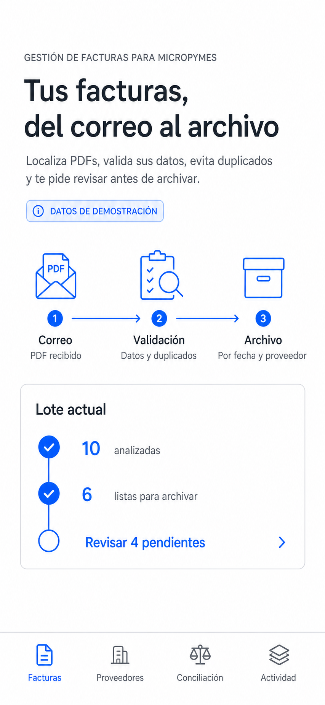
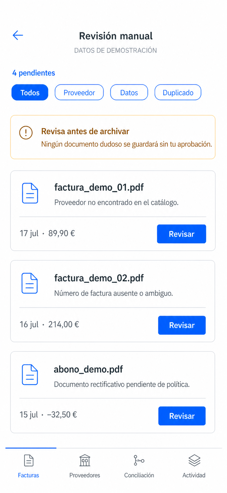
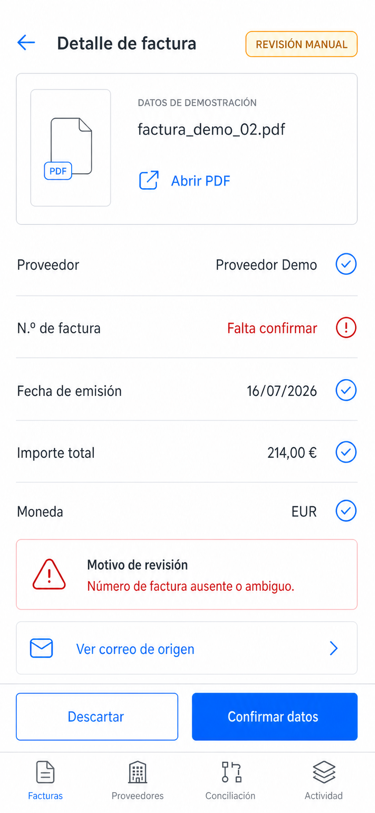
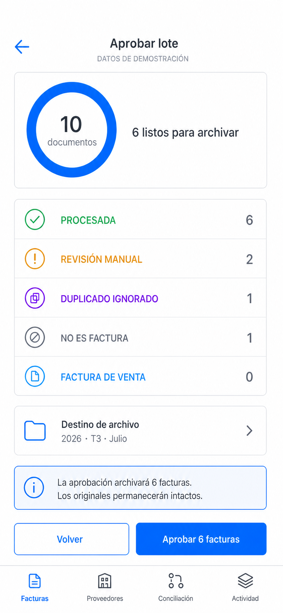

# Entrega · Sprint 2 del Viberano

## Objetivo

Diseñar con IA las pantallas móviles mínimas que explican el valor principal de la gestión de facturas de gasto: revisar un lote, resolver excepciones y aprobar únicamente documentos válidos con trazabilidad.

## Pantallas finales

### 1. Dashboard · pantalla estrella ⭐

Una persona que llega por primera vez entiende que la app localiza facturas PDF en el correo, valida sus datos y duplicados, pide revisión humana cuando hay dudas y las archiva por fecha y proveedor.

### 2. Revisión manual

El responsable consulta los documentos dudosos, entiende el motivo de cada excepción y elige cuál revisar sin que ninguno se archive automáticamente.

### 3. Detalle de factura

El responsable contrasta el PDF, los datos acreditados, el campo pendiente y el correo de origen antes de confirmar o descartar el documento.

### 4. Aprobación de lote

El responsable comprueba el reparto por estados, el destino de archivo y el número exacto de facturas antes de autorizar la escritura masiva.

## Decisiones de alcance

- Se entregan cuatro pantallas verticales y táctiles, el máximo recomendado por el reto.
- El dashboard es la pantalla estrella porque explica en menos de cinco segundos qué entra, qué valida la app, dónde interviene una persona y cómo queda organizado el archivo, sin dejar de conducir al trabajo pendiente.
- Proveedores, métricas, conciliación e historial quedan fuera de esta entrega visual mínima.
- El Sprint 2 contiene imágenes y reglas de diseño, no una aplicación funcional.
- `DESIGN.md` fija el nombre, los colores, la tipografía y los patrones que deberán reutilizarse en el siguiente sprint.

## Enlace del repositorio

[AItesterOK/Viberano](https://github.com/AItesterOK/Viberano)
